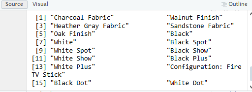

```{r setup, include=FALSE}
knitr::opts_chunk$set(echo = TRUE)
```


#1
```{r}
matrixA <- matrix(0, nrow = 5, ncol = 5)

vectorA <- 1:5

for (i in 1:5) {
  for (j in 1:5) {
    matrixA[i, j] <- abs(i - j)
  }
}

matrixA

```

#2
```{r}
for (i in 1:5) {        
  for (j in 1:i) {       
    cat("* ")           
  }
  cat("\n")               
}

```

#3
```{r}


Fibo_seq <- function() {
  cat("Enter the starting number for Fibonacci sequence: ")
  x <- as.integer(readline())
  
  if (is.na(x) || x < 1) {
    return("Please enter a positive integer")
  }
  
  fib <- numeric(0)
  
  if (x >= 1) fib[1] <- x
  if (x >= 2) fib[2] <- x
  
  i <- 3
  repeat {
    next_fib <- fib[i-1] + fib[i-2]
    if (next_fib > 500) break
    fib[i] <- next_fib
    i <- i + 1
  }
  
  return(fib)
}


 result <- Fibo_seq()
 cat("Fibonacci sequence up to 500:\n")

print(result)


```


#4
```{r}
shoe_size <- c(6.5, 9.0, 8.5, 8.5, 10.5, 7.0, 9.5, 9.0, 13.0, 7.5, 10.5, 8.5, 12.0, 10.5, 13.0 ,11.5, 8.5, 5.0, 10.0, 65, 75, 8.5, 10.5, 8.5, 10.5, 11.0, 9.0, 13.0)

height <- c(66.0, 68.0, 64.5, 65.0, 70.0, 64.0, 70.0, 71.0, 72.0, 64.0, 74.5, 67.0, 71.0, 71.0, 77.0, 72.0, 59.0, 62.0, 72.0, 66.0, 64.0, 67.0, 73.0, 69.0, 72.0, 70.0, 69.0, 70.0)

gender <- c("F", "F", "F", "F", "M", "F", "F", "F", "M", "F", "M", "F", "M", "M", "M", "M", "F", "F", "M", "F", "F", "M", "M", "F", "M", "M", "M", "M")


daf <- data.frame(shoe_size, height, gender)
daf

write.csv(daf, "daf.csv", row.names = FALSE)

read.csv("daf.csv")

daf


```

```{r}

#b.
male_dat <- subset(daf, gender == "M")
female_dat <- subset(daf, gender == "F")

male_dat
female_dat

count_f <- nrow(female_dat)
count_m <- nrow(male_dat)

print(paste("Number of Female observations:", count_f, "\n"))
print(paste("Number of Male observations:", count_m, "\n"))

```

```{r}

#c.
gender_count <- table(daf$gender)

gender_count
barplot(gender_count,
        main = "Number of Males and Females in Household Data",  
        xlab = "Gender",                                  
        ylab = "Count",                                   
        col = c("pink", "lightblue"),                       
        legend.text = c("Female", "Male"),                  
        args.legend = list(x = "topright", bty = "n"))   
```
```{r}

#5
expenses <- c(60, 10, 5, 25)
categories <- c("Food", "Electricity", "Savings", "Miscellaneous")

percent_labels <- paste0(categories, " (", round(expenses / sum(expenses) * 100), "%)")


pie(expenses,
    labels = percent_labels,
    col = c("lightgreen", "gold", "skyblue", "lightcoral"),
    main = "Monthly Expenses of Dela Cruz Family",
    cex = 0.8)

```

#6
```{r}
#a.
data(iris)
str(iris)

```
The iris dataset is a data frame with 150 observations and 5 variables.

Variables include:

Sepal.Length (numeric)

Sepal.Width (numeric)

Petal.Length (numeric)

Petal.Width (numeric)

Species (factor with 3 levels: setosa, versicolor, virginica)

Each row represents one flower observation with measurements and species category.

```{r}


#b.
mean_values <- colMeans(iris[, 1:4])
mean_values

```

```{r}

#c.

species_count <- table(iris$Species)

# Percentages
species_percent <- round(prop.table(species_count) * 100, 1)


labels_species <- paste(names(species_count), "\n", species_percent, "%", sep = "")


colors <- c("red", "green", "blue")

# Pie chart
pie(species_count, 
    main = "Species Distribution in Iris Dataset", 
    col = colors, 
    labels = labels_species)

legend("topright", legend = names(species_count), fill = colors, cex = 0.8)

```

```{r}

#d.
setosa <- subset(iris, Species == "setosa")
versicolor <- subset(iris, Species == "versicolor")
virginica <- subset(iris, Species == "virginica")

tail(setosa)
tail(versicolor)
tail(virginica)

```

```{r}

#e.

iris$Species <- as.factor(iris$Species)


colors <- c("setosa" = "red", "versicolor" = "green", "virginica" = "blue")
pch_values <- c("setosa" = 16, "versicolor" = 17, "virginica" = 18)

plot(iris$Sepal.Length, iris$Sepal.Width, 
     col = colors[iris$Species], 
     pch = pch_values[iris$Species],
     xlab = "Sepal Length",
     ylab = "Sepal Width",
     main = "Iris Dataset",
     sub = "Sepal width and length")

legend("topright", legend = levels(iris$Species), col = colors, pch = pch_values)

```
#f.
The scatterplot shows clear grouping based on species.

Setosa (red circles) has generally smaller sepal length and larger sepal width.

Versicolor (green triangles) and Virginica (blue diamonds) show some overlap but tend to have larger sepal length.

The different symbols and colors make it easier to distinguish species visually.

This supports that sepal measurements can be useful for classifying iris species.

```{r}
#7
library(readxl)


alexa <- read_excel("alexa_file.xlsx")


print(alexa)


```
```{r}

#a
unique(alexa$variation)

```
```{r}
#black variants 

# Fix leading/trailing/multiple spaces
alexa$variation <- trimws(gsub("\\s+", " ", alexa$variation))

# Standardize Black and White variants
alexa$variation <- gsub("^Black.*Dot$",  "Black Dot",  alexa$variation)
alexa$variation <- gsub("^Black.*Plus$", "Black Plus", alexa$variation)
alexa$variation <- gsub("^Black.*Show$", "Black Show", alexa$variation)
alexa$variation <- gsub("^Black.*Spot$", "Black Spot", alexa$variation)

alexa$variation <- gsub("^White.*Dot$",  "White Dot",  alexa$variation)
alexa$variation <- gsub("^White.*Plus$", "White Plus", alexa$variation)
alexa$variation <- gsub("^White.*Show$", "White Show", alexa$variation)
alexa$variation <- gsub("^White.*Spot$", "White Spot", alexa$variation)


unique(alexa$variation)


```

```{r}
#Snippet of output




```
```{r}
install.packages("dplyr")
library(dplyr)

```

```{r}
variations <- alexa %>%
  count(variation)

save(variations, file = "variations.RData")

variations

```
```{r}

#c
load("variations.RData")
counts <- variations$n
labels <- variations$variation

barplot(
  counts,
  names.arg = labels,
  col = rainbow(length(counts)),
  main = "Total Number of Alexa Variations",
  xlab = "Variation Type",
  ylab = "Count",
  las = 2,          # rotate labels for readability
  cex.names = 0.8   # shrink label text if long
)


```

```{r}

#d.
black_data <- variations[grep("^Black", variations$variation), ]

white_data <- variations[grep("^White", variations$variation), ]


par(mfrow = c(1, 2))

barplot(
  black_data$n,
  names.arg = black_data$variation,
  col = c("black", "firebrick2", "chartreuse3", "dodgerblue2", "cyan3"),
  main = "Black Variants",
  xlab = "Total Numbers",
  ylab = "Variants",
  las = 2,
  cex.names = 0.8
)

barplot(
  white_data$n,
  names.arg = white_data$variation,
  col = c("black", "firebrick2", "chartreuse3", "dodgerblue2", "cyan3"),
  main = "White Variants",
  xlab = "Total Numbers",
  ylab = "Variants",
  las = 2,
  cex.names = 0.8
)


```

